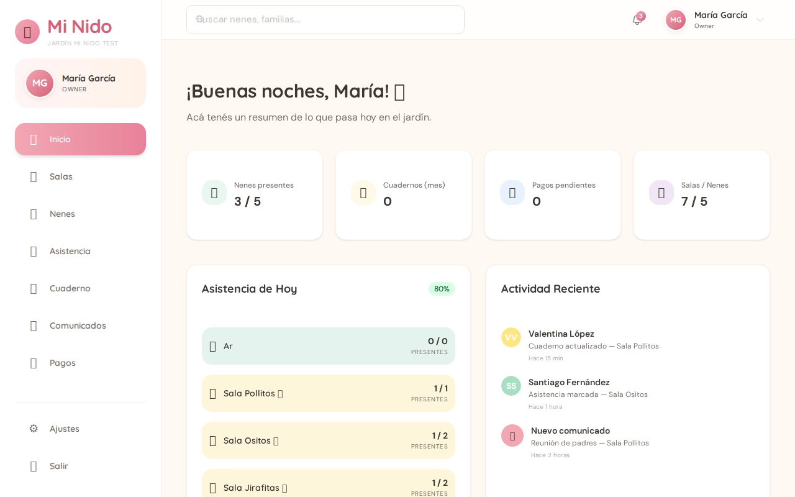

# E2E Test Results — Mi Nido
**Fecha:** 2026-02-14 20:05 (GMT-3)
**Frontend:** http://minido.38.105.232.177.sslip.io
**API:** http://api-minido.38.105.232.177.sslip.io/api

---

## Paso 1: Login API ✅
- **Token:** obtenido correctamente
- **gardenId:** `698fff58839b97c547dbc9ba` (Jardín Mi Nido Test)
- **Usuario:** María García (owner)

## Paso 2: Salas via API ✅
Ya existían 4 salas (3 creadas previamente + 1 extra "Ar"):

| Sala | Edad | Turno | Capacidad | ID |
|------|------|-------|-----------|----|
| Sala Pollitos 🐥 | 0-1 | mañana | 15 | `6990fc60...b082` |
| Sala Ositos 🧸 | 1-2 | mañana | 20 | `6990fc66...b085` |
| Sala Jirafitas 🦒 | 2-3 | tarde | 18 | `6990fc6c...b088` |
| Ar ⭐ | 1-2 | mañana | 20 | `6990e0c1...b032` |

## Paso 3: Crear 5 nenes via API ✅
Todos creados exitosamente. **Nota:** el campo `gender` requiere `F`/`M`/`X` (no `female`/`male`).

| Nene | Nacimiento | Sala | Género | Contacto |
|------|------------|------|--------|----------|
| Valentina López | 2024-03-15 | Sala Pollitos | F | María López (madre) |
| Santiago Rodríguez | 2023-08-20 | Sala Ositos | M | Carlos Rodríguez (padre) |
| Mía García | 2023-01-10 | Sala Ositos | F | Ana García (madre) |
| Mateo Fernández | 2022-11-05 | Sala Jirafitas | M | Pablo Fernández (padre) |
| Sofía Martínez | 2022-06-22 | Sala Jirafitas | F | Laura Martínez (madre) |

## Paso 4: Verificación Visual (Playwright)

### Dashboard ✅

- **Stats visibles:** 0/5 Nenes presentes, 0 Cuadernos, 0 Pagos pendientes, **4/5 Salas/Nenes**
- **Asistencia de Hoy:** muestra las 4 salas con conteo (Ar 0/0, Pollitos 0/1, Ositos 0/2, Jirafitas 0/2)
- **Actividad Reciente:** muestra actividad (Valentina López, Santiago Fernández, etc.)
- **Veredicto:** ✅ Dashboard refleja datos reales correctamente

### Salas ⚠️ BUG

- **Error:** "Ups, no pudimos cargar las salas. Intentá de nuevo 😅"
- Muestra "Todavía no hay salas" a pesar de que existen 4 vía API
- **Veredicto:** 🐛 Bug en frontend — la página `/salas` no carga las salas correctamente

### Nenes ⚠️ BUG

- **Error:** "Ups, no pudimos cargar los nenes. Intentá de nuevo 😅"
- Muestra "Todavía no hay nenes registrados" a pesar de que hay 5 vía API
- **Veredicto:** 🐛 Bug en frontend — la página `/ninos` no carga los nenes correctamente

---

## Resumen

| Componente | Estado |
|-----------|--------|
| API Login | ✅ OK |
| API Classrooms (CRUD) | ✅ OK |
| API Children (CRUD) | ✅ OK |
| Frontend Login | ✅ OK |
| Frontend Dashboard | ✅ OK — muestra stats reales |
| Frontend /salas | 🐛 BUG — error al cargar |
| Frontend /ninos | 🐛 BUG — error al cargar |

### Bug probable
Las páginas `/salas` y `/ninos` probablemente no están enviando `gardenId` correctamente en las requests GET, o el frontend no está extrayendo el gardenId del token/estado de sesión al navegar directamente a esas rutas.

**Recomendación:** Revisar cómo el frontend obtiene y envía `gardenId` en los componentes de Salas y Nenes. El Dashboard funciona correctamente, lo que sugiere que usa un mecanismo diferente para obtener gardenId.
